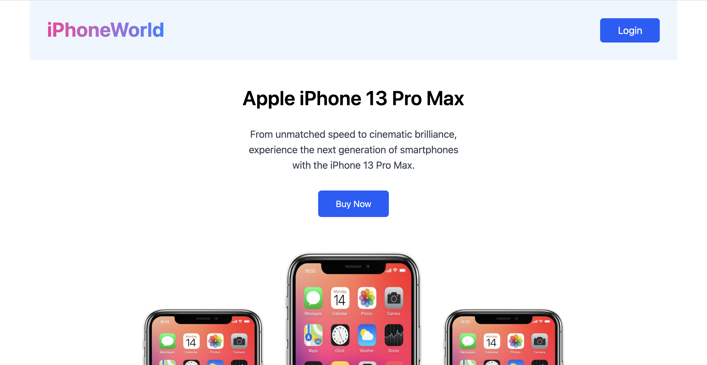

# 📱 iPhoneWorld - Premium iPhone Showcasing Website

Welcome to **iPhoneWorld**, a beautiful and responsive single-page React application that showcases Apple iPhones with engaging animations and clean UI design. This project is perfect for learning or demonstrating skills in frontend development, React, Tailwind CSS, and JSON data handling.

---

## 📸 Screenshots

### 🖥️ Desktop View

### 📱 Mobile View

> Screenshots are stored inside the `/screenshots` folder (create one in your project root).

---

## ✨ Features

- 🔥 Animated UI with AOS (Animate On Scroll)
- ⚡ JSON-based dynamic product data rendering
- 📱 Fully responsive layout for mobile & desktop
- 🎨 Tailwind CSS styling
- 🛒 “Order Now” action buttons
- 📧 “Notify Me” email input section
- 📦 Organized component structure
- 🔗 Social media icons & navigation links in footer

---

## 🛠️ Tech Stack

- **React.js**
- **Tailwind CSS**
- **AOS (Animate On Scroll)**
- **React Icons**
- **Vite** (for fast development)

---

## 📁 Folder Structure Overview

